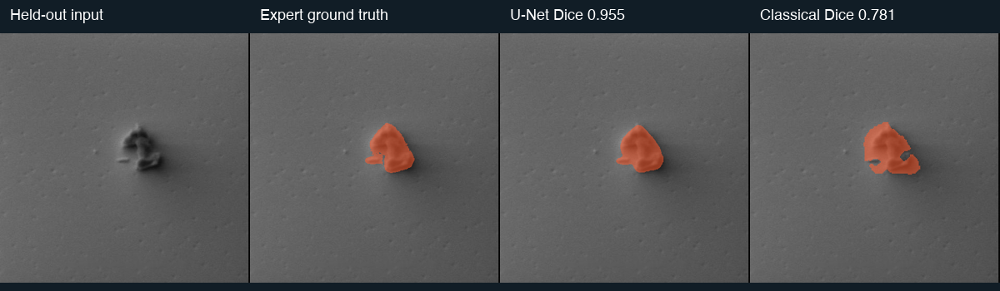
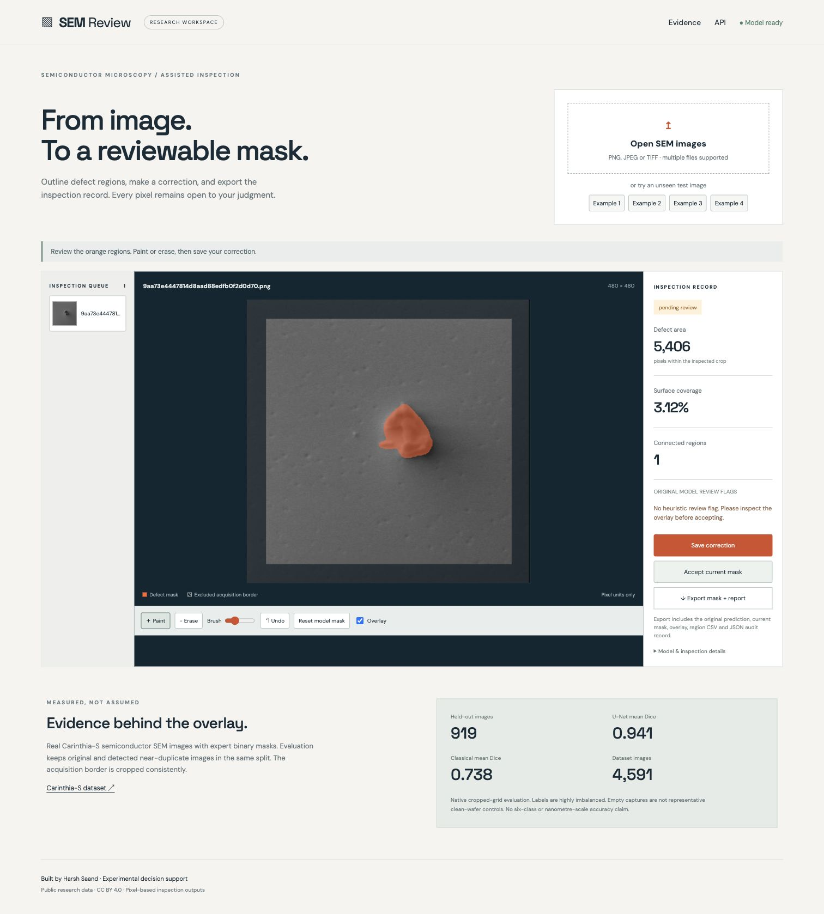

# SEM Review

A working semiconductor SEM inspection tool: upload an image, segment defect regions, edit or accept the mask, and export a traceable inspection record. Built by Harsh Saand using the public Carinthia-S dataset.

The application produces **binary masks, overlays, pixel-area measurements, connected-region records, correction revisions, and CSV/JSON/PNG exports**. It is an experimental review assistant, not a fab disposition system. The model does not infer nanometres or claim reliable six-class defect classification.

## Measured results

On **919 held-out images**, the U-Net achieved **0.941 mean Dice / 0.895 IoU**, compared with **0.738 Dice / 0.602 IoU** for the validation-selected classical baseline. Native cropped-grid boundary F1 at a 2-pixel tolerance was 0.778 versus 0.274. Mean absolute area error was417 pixels versus 2,247 pixels. The model has 275,161 parameters and trained for 12 epochs on Apple MPS.

Warmed CPU forward inference took 22.3 ms median across 30 runs with 4 threads; this excludes preprocessing, file I/O and browser/network time. Per-class supports are 11, 2, 802, 58, 1 and 45, so these are predominantly majority-class results. All 45 empty test masks remained empty, but these are misaligned captures and do not establish production false-alarm performance.



## Run the trained application

```bash
uv venv --python 3.11
uv pip install --python .venv/bin/python -r requirements-lock.txt
.venv/bin/python -m uvicorn semreview.app:app --host 127.0.0.1 --port 8766
```

Open [http://127.0.0.1:8766](http://127.0.0.1:8766). Trained weights and a small set of held-out examples are included in `artifacts/`; the full raw dataset is not needed to try the app. CPU inference is the default. Uploaded images and human corrections stay in the local `reviews/` directory, which is excluded from Git.

1. Open one or several SEM images, or select a held-out example.
2. Inspect the orange mask. Paint/erase with the brush; undo or reset as needed.
3. **Save correction** recalculates measurements and preserves the original model mask. **Accept current mask** records human acceptance without changing pixels.
4. **Export mask + report** returns a ZIP containing the source, model prediction, current mask, overlay, per-region CSV, inspection CSV, JSON provenance and every saved correction.

The 32-pixel margin on every side is excluded, visually shaded, and cannot be annotated through this workflow. Coverage uses the interior area as its denominator. All measured regions use original-image pixel coordinates. Model inference internally resizes the cropped image to 192×192, then restores probabilities to the original crop size before thresholding.

## Real data and provenance

- [Carinthia-S, Zenodo record 16895427](https://zenodo.org/records/16895427), published 20 August 2025, **CC BY 4.0**.
- Dataset archive: 139,225,942 bytes; the download script verifies the publisher's MD5 checksum before extraction.
- 4,591 real 480×480 grayscale SEM images with expert-validated segmentation masks.
- Label supports: 1: 55, 2: 8, 3: 4,008, 4: 289, 5: 4, 6: 227. We train binary segmentation only.
- 395 mask files contain gray antialias values. Any nonzero annotation pixel is treated as foreground in both training and native-resolution evaluation.
- Class 6 includes misaligned microscope captures without visible defects. It is **not** a representative clean-wafer control group.
- No wafer/lot identifiers or physical pixel-size calibration are supplied. A pixel area is not a physical area, and an image-level holdout is not a fab-level validation.

See `DATA_ATTRIBUTION.md`, `artifacts/data_audit.json` and the complete public `artifacts/split_manifest.csv`.

## Reproduce

```bash
.venv/bin/python scripts/download_data.py
.venv/bin/python scripts/prepare_data.py
.venv/bin/python scripts/train.py --epochs 12 --batch-size 24
.venv/bin/python scripts/evaluate.py
.venv/bin/python -m pytest -q
```

Training automatically uses Apple Silicon MPS when available, otherwise CPU. Evaluation uses CPU. Seeds, architecture, optimization settings, selected epoch/threshold, training trace, model hash, per-image measurements and outputs are retained in `artifacts/`.

### Data separation and model selection

A fixed 32 px crop removes acquisition borders consistently. Before augmentation, images are checked for identical cropped-pixel SHA256 and potential visual duplicates. The final rule joins pairs only if pHash distance ≤4/63, 128 px thumbnail RMSE ≤2 gray levels, and central 128 px correlation ≥0.995. No exact or qualifying near duplicates were found. Seed 41 five-fold stratified grouping assigns 2,754 images to training, 918 to validation and 919 to test.

The initial diagnostic used a much looser 32 px thumbnail threshold and merged 3,539 visually similar centered-particle images into a component. This was a morphology cluster, not credible evidence of duplicate identity. The tighter rule was chosen from the image audit before final training and any test evaluation. A discarded training run had progressed while UI work continued; its scores did not drive the image-based change. The initial audit is retained for transparency.

The compact U-Net has 275,161 parameters, GroupNorm, and no pretrained weights. It uses BCE plus soft Dice, mild brightness/contrast and rotation/reflection augmentation, and inverse-square-root class-frequency sampling based on training labels. The best checkpoint and one of seven probability thresholds are selected by validation mean Dice. Test masks do not influence model selection.

A classical contrast/morphology baseline uses local Gaussian or global median background subtraction, thresholding, hole filling and minimum region size. Ten fixed parameter choices are compared on validation only. Test evaluation restores both methods to the native cropped 416×416 grid and reports per-image and per-class Dice, IoU, two-pixel-tolerance boundary F1, pixel-area error and absolute coverage error.

### Reading the review flag

The review score is a simple heuristic based on mean confidence inside the predicted region, with extra flags for an empty, very small or unusually large prediction. It is **not calibrated Bayesian uncertainty or a probability that the inspection is wrong**. `metrics.json` reports empirical error across retained fractions ranked by this score; a favorable trend is not assumed. Every inspection still requires human judgment.

## Working interface



An unmodified real app export is retained in `artifacts/demo_inspection/`. It is a pending model annotation, not a falsely claimed expert acceptance.

## API

Interactive API docs: `/docs`.

```bash
curl -F file=@example.png http://127.0.0.1:8766/api/inspect
curl -F mask=@corrected-mask.png http://127.0.0.1:8766/api/reviews/REVIEW_ID/correct
curl -X POST http://127.0.0.1:8766/api/reviews/REVIEW_ID/accept
curl -o inspection.zip http://127.0.0.1:8766/api/reviews/REVIEW_ID/export
```

A correction must match the original image dimensions. The service validates image size and clamps corrections to the inspected crop. `prediction.png` is immutable; `mask.png` is the current revision. Exports distinguish pending, accepted and corrected records.

## Evidence and limitations

Machine-readable results are in `artifacts/metrics.json`, with per-image support in `artifacts/test_per_image.csv`. `artifacts/heldout_panels.png` compares held-out inputs, expert masks, U-Net output and the classical baseline. Examples are selected as the median-scoring image in each supported test class plus the lowest-Dice foreground failure; they are not a gallery of only the best cases.

The dataset is heavily imbalanced and comes from one production layer. Centering and electron-framing artifacts can remain shortcuts after border removal. The model may fail on other tools, layers, textures, magnifications and unfamiliar defects. Tiny features can be lost through 192 px resampling. Results describe held-out image segmentation; process/yield improvement and equipment control are outside the project scope.

Own code: MIT. Dataset and included derived example images: CC BY 4.0 with attribution. Trained model weights are research artifacts derived from the cited data.
